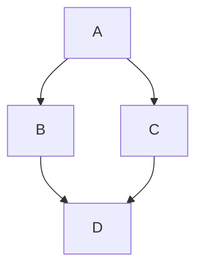

# Edit Distance
The number of operations required to convert a string to another one is called the edit distance between the two strings.

## Operations 
1. Insertion 

    Insert characters from the target string to the source string. 

    
    e.g. 
    
    ISHAN (source)     --->  NISHANT (target)

    ISHAN --(insert N)--> NISHAN --(insert T)--> NISHANT 
2. Deletion
3. Replacement

# Problem Statement
